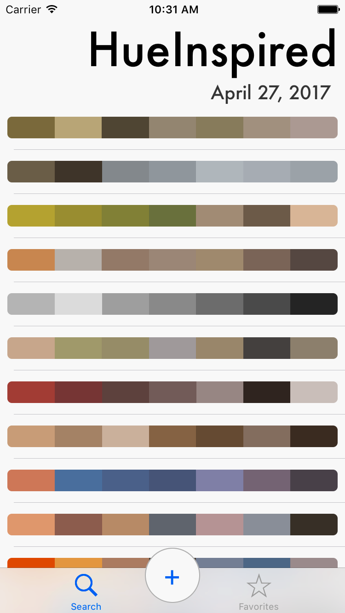
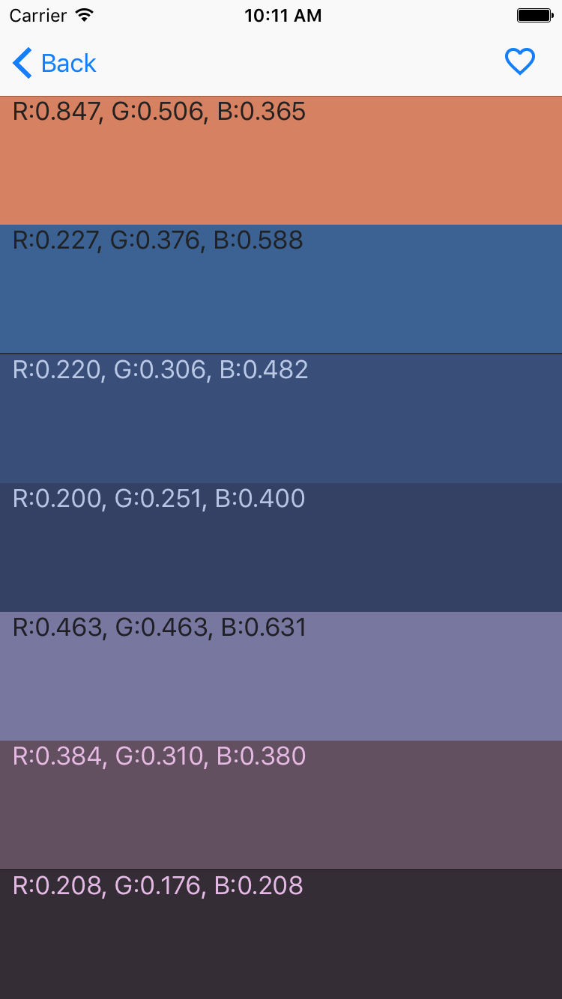

# HueInspired 
 

## Description

An application that helps artists discover inspiration from their photo collection. It picks a series of dominant colors from a photo to form a color palette. Users can see the currently trending photos on Flickr transformed as palettes as well as their own photo collection. It uses NSURLSession to retrieve network data, Core Data as its persistence layer and a table view with custom cells to display it all.

## How to build
HueInspired depends on PromiseKit and Swinject which can be handled by Carthage

### Steps:

1. Install Carthage ( see https://github.com/Carthage/Carthage )
2. Clone repository
3. Run Carthage Bootstrap in repo root

And thats it, open in xcode and run.

