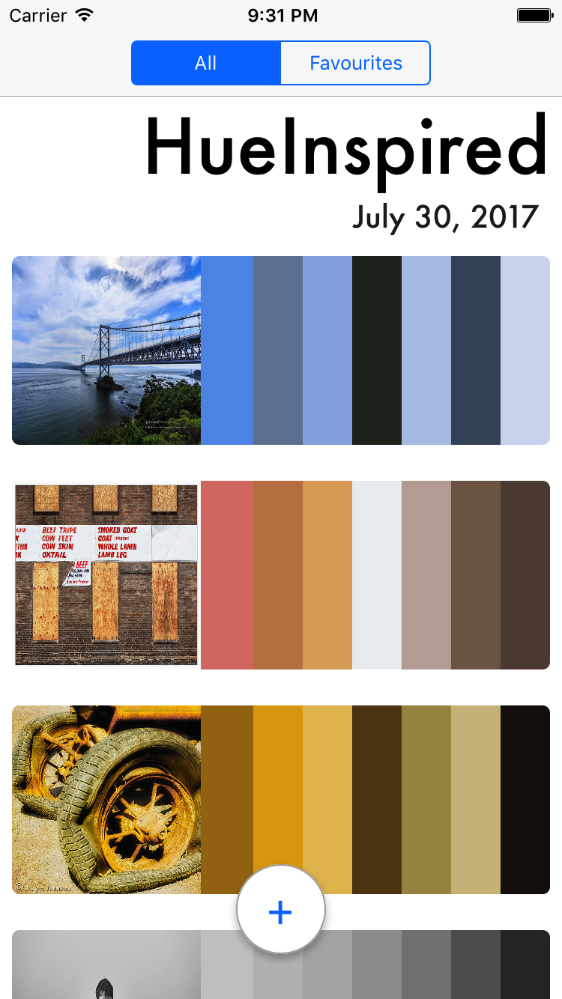
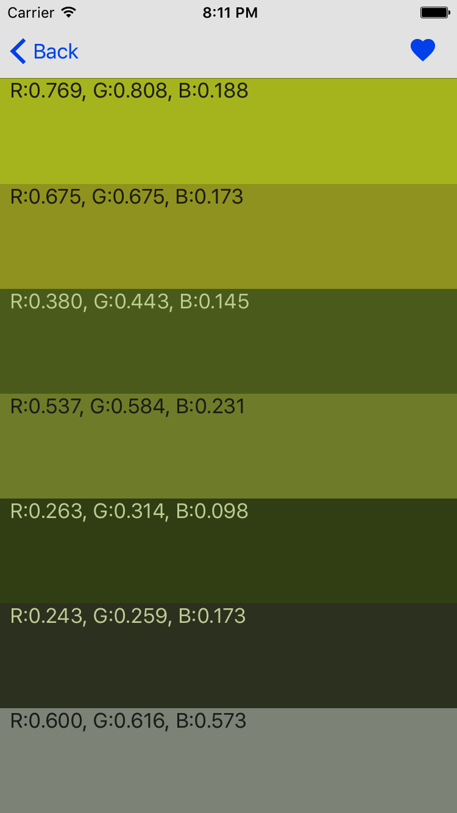

# HueInspired 
 

## Application Description

An application that helps artists discover inspiration from their photo collection. It picks a series of dominant colors from a photo to form a color palette. Users can see the currently trending photos on Flickr transformed as palettes as well as their own photo collection. Under the hood we use leverage Vanilla NSURLSessions with PromiseKit for networking and Core Data for our persistence.

## System Overview

 

The app is designed to be cleanly separated into two parts: Core and Features.

Core defines components of the app which others can rely on. Its consists of the main data model and lower level services like networking and persistence. These are both presented behind protocols to decouple consuming code from concrete implementations. Through abstract factories we provide data layer objects without having client code specify explicit classes.

Features are components designed together to fulfil a user facing requirement. We aim for clean vertical slicing between them with the goal that a change to one feature should _NEVER_ effect another. The components that make up a feature can only depend on each other and core. They have no knowledge of any class or struct created within another feature. 

The benefits of this approach:

- Strong modularity between features, everything can be put behind a feature flag allowing you to turn on and off features as required - great for testing and feature roll out. 
- A Explicit understanding of a changes scope. Features can generally be freely refactored, where as changes to core require caution. 

Features can interact with each other, but its through core protocols i.e.. view controllers from Feature A will interact with services in feature B via a delegate protocol exposed in core. 

## Building
HueInspired depends on PromiseKit and Swinject which can be handled by Carthage

### Steps:

1. Install Carthage ( see https://github.com/Carthage/Carthage )
2. Clone repository
3. Run Carthage Bootstrap in repo root

And thats it, open in xcode and run.

